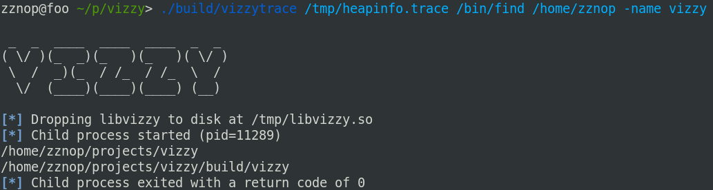

# vizzy



## Description

**Vizzy is a suite of dynamic analysis tools for profiling heap usage and memory management.** Vizzy consists of a
tracer application (`vizzytrace`) that injects (`LD_PRELOAD`'s) a shared object into a process to hook libc allocation
and free APIs. These hooks log timestamped information on each allocation and free to a trace file for post-processing.
Vizzy contains a script (`vizzyreport.py`) that can processes vizzy trace files to generate reports and visualizations.


# Build

To build `vizzytrace` and `libvizzy` install SCons from the package manager and run:

```
scons
```

`vizzyreport.py` requires the Python 3 Bokeh package. This can be installed using pip.

```
pip install bokeh
```
