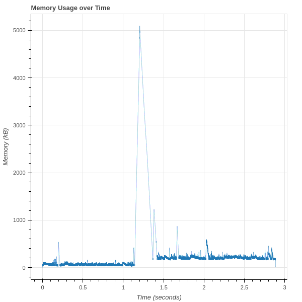

# vizzy

```
> ./build/vizzytrace /tmp/heapinfo.trace /bin/find /home/zznop -name vizzy

 _  _  ____  ____  ____  _  _
( \/ )(_  _)(_   )(_   )( \/ )
 \  /  _)(_  / /_  / /_  \  /
  \/  (____)(____)(____) (__)

[*] Dropping libvizzy to disk at /tmp/libvizzy.so
[*] Child process started (pid=13849)
/home/zznop/projects/vizzy
[*] Child process exited with a return code of 0
> python3 ./script/vizzyreport.py /tmp/heapinfo.trace 
HEAP SUMMARY:
    in use at exit   : 11060 bytes in 58 blocks
    total heap usage : 422216 allocs, 422157 frees, 792452324 bytes allocated
```

## Description

**Vizzy is a suite of dynamic analysis tools for profiling heap usage and memory management.** Vizzy consists of a
tracer application (`vizzytrace`) that injects (`LD_PRELOAD`'s) a shared object into a process to hook libc allocation
and free APIs. These hooks log timestamped information on each allocation and free to a trace file for post-processing.
Vizzy contains a script (`vizzyreport.py`) that can processes vizzy trace files to generate reports and visualizations.

## Usage

### vizzytrace

```
vizzytrace <log> <command>

Required:
  log        Path to output trace log
  command    Command to execute (specify the full path to the executable)

Example:
  vizzy /tmp/heaptrace.csv /bin/find . -name vizzy
```

To run a process under `vizzytrace` first supply the path to where the trace log should be written to, then supply
the command line starting with the full path to the tracee executable. `vizzytrace` will take the following steps:
1. Patch `libvizzy`'s config section with the file path for where it should write the trace file
2. Drop `libvizzy` to `/tmp`
3. Spawn the tracee executable as a child process and preload the `libvizzy` shared object
4. Wait on the child process to exit

### vizzyreport.py

```
usage: vizzyreport.py [-h] [--heap-layout-time HEAP_LAYOUT_TIME] [--mem-usage]
                      tracefile

positional arguments:
  tracefile             File path to vizzy heap trace file

optional arguments:
  -h, --help            show this help message and exit
  --heap-layout-time HEAP_LAYOUT_TIME
                        Visualize heap layout at specified time
  --mem-usage           Visualize heap memory usage over time
```

**Example Visualization:**


# Build

To build `vizzytrace` and `libvizzy` install SCons from the package manager and run:

```
scons
```

`vizzyreport.py` requires the Python 3 Bokeh package. This can be installed using pip.

```
pip install bokeh
```
